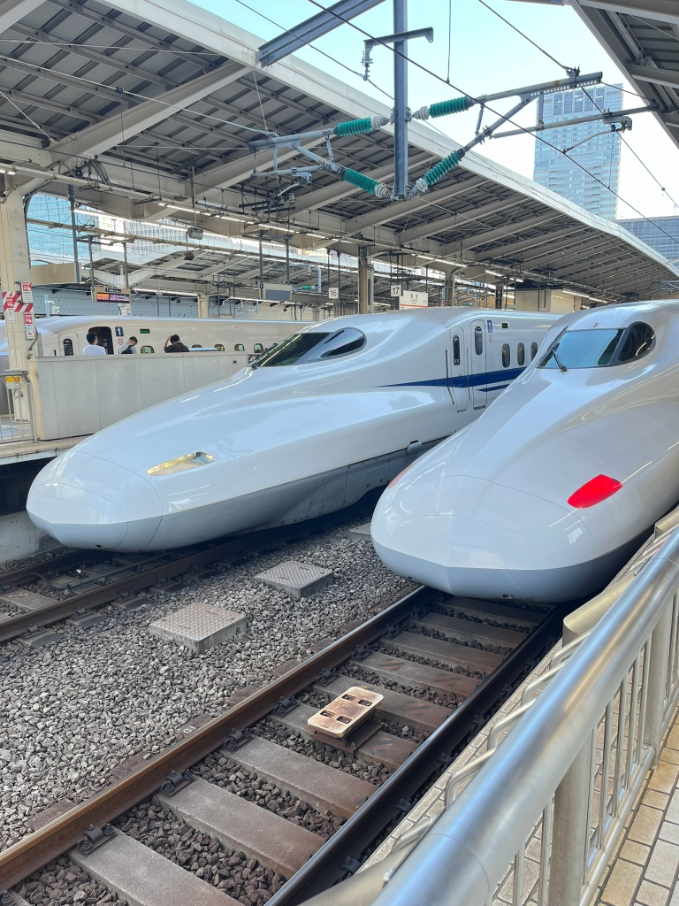
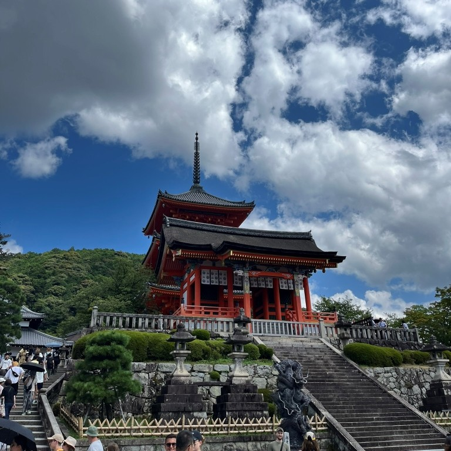

### Under Construction

	

	

		

			
		

		

			
		

		

			
		

		

			
		

		

			
		

		

			
		

		<figcaption>Japan</figcaption>
		

	

<!--

  

    
  

  

    
  

  

    
  

  

    	
  

 

-->
